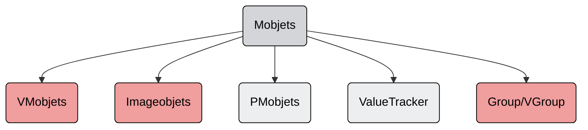
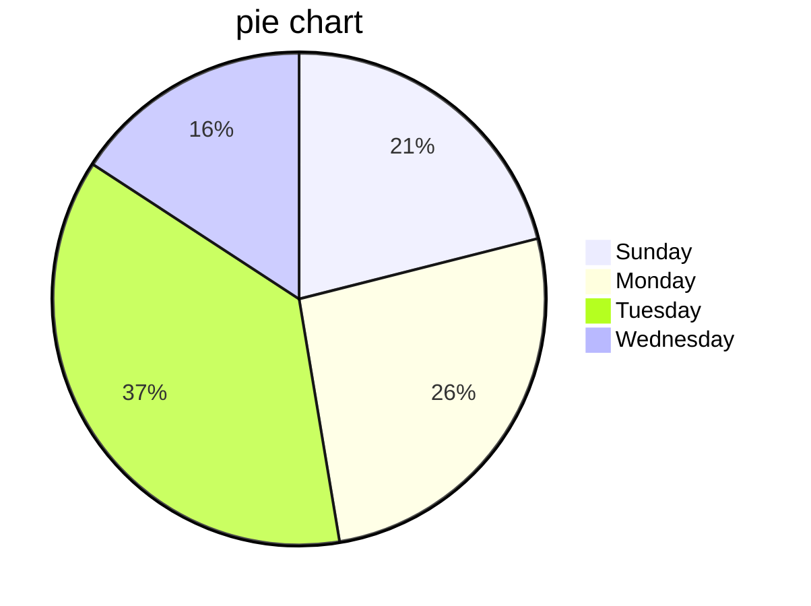

# Curso de manimCE
## Introducción

Para poder utilizar manim es necesario tener conocimientos previos de python, en especifico, programación orientada a objetos, herencia, estructura de datos, entornos virtuales, manejo de python en consola, etc. 

* Herramientas que utiliza manim
  * Python
    * Manim utiliza python para convertir las figuras a un lenguaje especial,  este lenguaje especial después es trasferido a Cairo.
  * Cairo
    * Toma el lenguaje especial y lo convierte a una serie de imágenes que son los frames de la animación. Al mismo tiempo toma estas imágenes y las pasa a FFmpeg.
  * FFmpeg
    * El cual toma todos los frames y los concatena para convertirlo en un video.

* Python  → Cairo  → FFmpeg 


## Instalación

Para instalar manim es necesario primero contar con los programas necesarios para su correcto funcionamiento, entre estos estan:

* Python 3.7 o superior
* TeXLive o MiKTeX o cualquier motor de TeX, se recomiendo el primero.
* Scoop.sh, el cual es un administrador de paquetes para windows por consola.
  * Instalar ffmpeg con `scoop install ffmpeg`

Una vez instaladas las herramientas anteriores es necesario crear un entorno virtual, activarlo e instalar manim con el siguiente comando `python -m pip install manin` o simplemente `pip install manim`

Para más información sobre la instalación dirigirse al siguiente [enlace](https://docs.manim.community/en/stable/installation/windows.html), o al siguiente [video](https://www.youtube.com/watch?v=CYOLQk8GpME&t=2s)


## Metodología

* Todas las animaciones se crean a partir de la clase `Scene`, es decir una clase que herede todas las propiedades de `Scene`.
* Dentro del método `construct()` se escribe toda la lógica que tendrá la animación.


### Noción básica

Este es un ejemplo de lo que normalmente se encontrará en foros en linea

```python
from manim import *

class MyScene(Scene):
    def construct(self):
        # Define Mobjets
        circle = Circle()
        # Animation
        self.play(GrowFromCenter(circle))
        self.wait()
```


Para trabajar con jupyter en vscode es necesario instalar las extensiones: 

* Color Highlight
* Jupyter
* Jupyter keymap
* Jupyter Notebook renders
* MagicPython
* Pylance
* Python
* Activitus Bar

Después en el Command Palette:  Jupyter: Create Interactive Window y guardar el archivo con la extensión correcta.

```python
from manim import *
config.media_width = "100%"
```


```python
%% manim -v WARNING --disable_caching -qm MyScene
class MyScene(Scene):
    def construct(self):
        # Define Mobjets
        circle = Circle()
        # Animation
        self.play(GrowFromCenter(circle))
        self.wait()
```


También se puede trabajar con manim como si fuera un módulo de la siguiente manera:

```python
from manim import *
from pathlib import Path
import os

FLAGS = f"-pqm -v WARNING --disable_caching"
SCENE = "MyScene1"

class MyScene1(Scene):
    def construct(self):
        self.play(GrowFromCenter(Circle()))

class MyScene2(Scene):
    def construct(self):
        self.play(Create(Square()))


if __name__ == "__main__":
    script_name = f"{Path(__file__).resolve()}"
    os.system(f"manim {script_name} {SCENE} {FLAGS}")


if __name__ == "__main__":
    script_name = f"{Path(__file__).resolve()}"
    os.system(f"manim {script_name} {SCENE} {FLAGS}")
```


### Ejecución

Para ejecutar nuestros programas en manim es necesario primero activar nuestro entorno virtual y después en la terminal ejecutar el siguiente comando:

```
manim my_animation.py MyScene -qm 
```

### Flags

| Flag                  | Significado                    |
| --------------------- | ------------------------------ |
| `-ql`,  `-qm`,  `-qh` | Quality, low, medium, high     |
| `-s`                  | Export last frame of animation |
| `-p`                  | Preview                        |


En caso de que la animación no tenga duración en automático se renderizara como imagen. Todo lo que se necesita es una pausa para que se renderice como video.


## Teoría

Los objetos que se pueden desplegar en pantalla se llaman Mobjets o Matematical Objects







## Enlaces útilies

* [Intro To Manim - ManimCE Professional Course](https://docs.devtaoism.com/docs/html/index.html)
